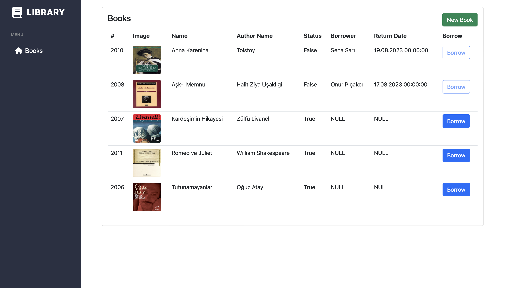
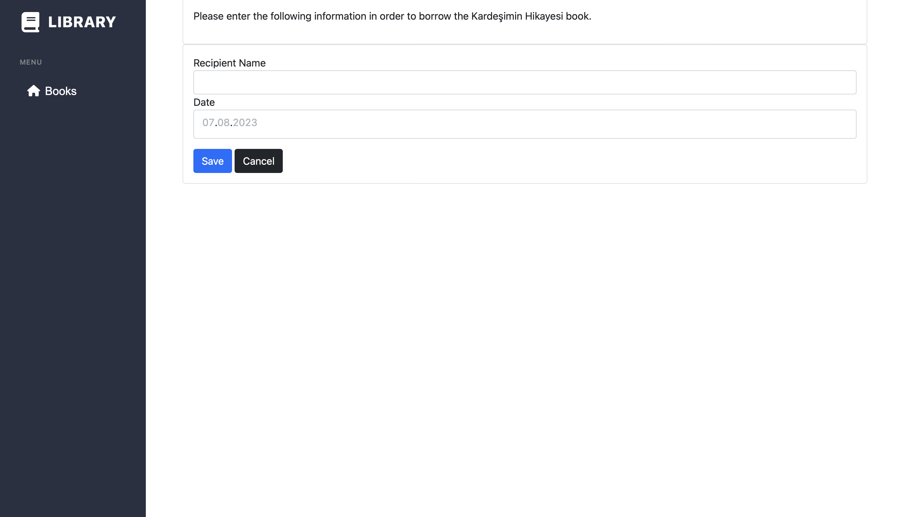

## Library-App

## TÜRKÇE
Bu uygulama işe alım sürecindeki verilen case sonucunda yapılmıştır. Uygulama tek bir katmanla da yapılabilecek düzeyde ve kolaylıkta olmasına rağmen tecrübelerimi gösterebilmek adına Çok Katmanlı Mimari yapısını kullandım. Entity, DataAccess, Business ve UI katmanı olarak ayırabilecek şekilde toplamda 4 katmana ayırdım.

- Entity katmanında Book klasörü içerisinde farklı property'lere sahip bir Book Entity'si oluşturdum. 
- DataAccess katmanında veri tabanına bağlanabilmek context sınıfını ekledim. Aynı zamanda ekleme, güncelleme, silme gibi CRUD işlemlerinin de yapıldığı işlemleri bu katmana yazdım.
- Business katmanında iş kurallarının yazıldığı yani Uİ ile veri tabanı arasındaki requestleri karşılamadan önce geçilmesi gereken kuralları bu katmana yazdım. Ekstra olarak validation işlemlerini de buraya ekledim. Validation için FluentValidation kütüphanesini kullandım.
- Son olarak UI katmanında Get ve Post işlemlerinin, veri alışverişini yapıldığı katmanda gerekli işlemleri yaptım. Kullanıcı arayüzü olarak farklı tema template'leri veya çok daha kullanıcı dostu tasarımlar yapılabilirdi ancak verdiğiniz case doğrultusunda işlemlerin doğru ve eksiksiz yapılmasında daha dikkatli oldum.

Verdiğiniz case doğrultusunda tek bir Book tablosuyla işlemleri gerçekleştirdim. Kitabın özellikleri haricinde kitabı ödünç alacak kişinin adını ve kitabı geri getirme tarihiyle alakalı property'i de bu entity içerisinde tuttum. Ödünç alan kişinin bilgisi login gibi bir işlem olsaydı User tablosu oluşturularak yapılabilirdi ancak uygulama çok komplike olmadığı için 2 tablo arasında ilişki kurmaya gerek kalmadığını düşündüm.

Anasayfada kitapların alfabetik sıraya göre listelenmesini backend tarafında yaptım. Status -> True olduğu durumda kitabın mevcut olarak kütüphanede bulunduğunu belirtiyor ve **Borrower** butonu aktif oluyor. Eğer kitap ödünç alındıysa Status -> False oluyor ve ödünç alan kişi ve geri dönüş tarihi listeye ekleniyor. Ekstra olarak ödünç al yani **Borrower** butonu da disabled oluyor.

Name, AuthorName ve Image dosyası ile birlikte yeni bir kitap ekleyebiliyoruz. Bu işlemleri FluentValidation kütüphanesiyle kontrollerini yapacak şekilde düzenledim. Eklediğimiz kitap resmini **wwwroot/img** klasörü içerisinde kaydedip veritabanında da resimin yolunu kaydederek kullanıcı arayüzünde gösterdim.

Son olarak ödünç alma yani **Borrow** sayfasına girdildiğinde üst tarafta ödünç alınacak kitabın adı geliyor. Form'da da ödünç alacak kişinin bilgisi ve kitabı geri getireceği tarihi giriş yapıp veri tabanına anlık olarak kaydediyoruz.

Uygulamanın ekran görüntüleri: 

## ENGLİSH

This application was made as a result of the case given during the recruitment process. Although the application is at a level and ease that can be done with a single layer, I used the Multilayer Architecture structure in order to show my experience. I divided it into 4 layers in total, which can be divided into Entity, DataAccess, Business and UI layers.

In the Entity layer, I created a Book Entity with different properties in the Book folder.
In the DataAccess layer, I added the context class to connect to the database. I also wrote CRUD operations such as insert, update, delete in this layer.
In the Business layer, I wrote the business rules, that is, the rules that must be passed before meeting the requests between the UI and the database. I also added validation operations here. I used the FluentValidation library for validation.
Finally, in the UI layer, I did the necessary operations in the layer where Get and Post operations and data exchange are performed. Different theme templates or much more user-friendly designs could have been made as a user interface, but in line with the case you gave, I was more careful in making the operations correct and complete.
In line with the case you gave, I performed the operations with a single Book table. Apart from the properties of the book, I also kept the name of the person who will borrow the book and the property related to the date of returning the book in this entity. If the borrower's information was a process like login, it could be done by creating a User table, but since the application is not very complicated, I thought there was no need to establish a relationship between 2 tables.

I made the listing of books in alphabetical order on the homepage on the backend side. When Status -> True, it indicates that the book is currently in the library and the Borrower button is active. If the book is borrowed, Status -> False and the borrower and return date are added to the list. In addition, the Borrower button is disabled.

We can add a new book with Name, AuthorName and Image file. I organized these operations to check them with the FluentValidation library. I saved the book image we added in the wwwroot/img folder and saved the path to the image in the database and showed it in the user interface.

Finally, when you enter the Borrow page, the name of the book to be borrowed appears at the top. In the form, we enter the information of the borrower and the date when the book will be returned and save it to the database instantly.

Screenshots of the application:

## Books Page

## New Book Page

## Borrow Page

